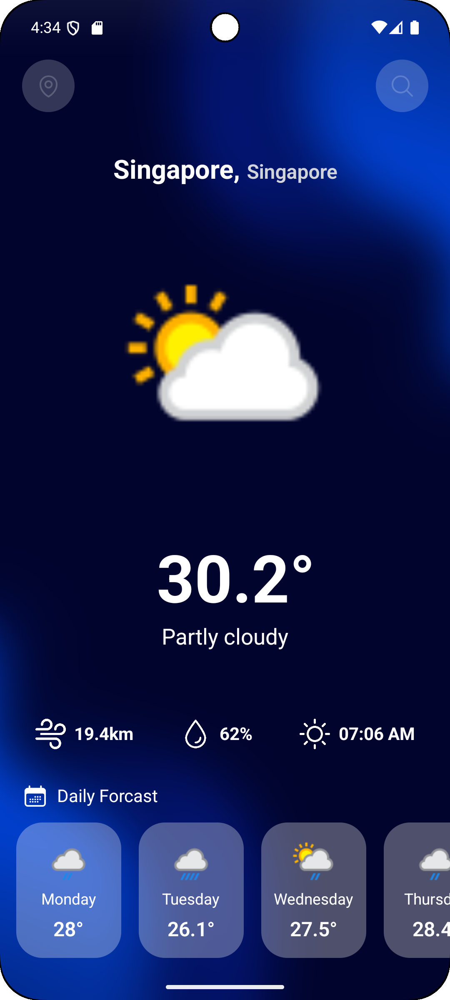

# WeatherWise – A Smart Weather Forecast App

A React Native-based mobile app designed to provide real-time location-based weather forecasts and 7-day predictions.

## Features

- 🌤️ Real-time weather data with current conditions
- 📍 Location-based weather detection with GPS
- 🔍 Global city search with auto-suggestions
- 📅 7-day detailed weather forecast
- 🌡️ Comprehensive weather metrics (temperature, humidity, wind speed, sunrise)

## Screenshots



## Tech Stack

- **React Native CLI** - Cross-platform mobile development
- **NativeWind (Tailwind CSS)** - Styling and responsive design
- **Axios** - HTTP client for API requests
- **Lodash** - Utility functions (debounce)
- **React Native Geolocation Service** - GPS location services
- **React Native Permissions** - Permission handling
- **React Native Safe Area Context** - Safe area handling

## Installation

### Prerequisites

Make sure you have completed the [React Native - Environment Setup](https://reactnative.dev/docs/getting-started-without-a-framework) instructions.

### Step 1: Clone the Repository

```bash
git clone https://github.com/Hardik0602/WeatherWise.git
cd WeatherWise
```

### Step 2: Install Dependencies

```bash
npm install
# or
yarn install
```

### Step 3: Setup NativeWind (Tailwind CSS)

Follow the [NativeWind installation guide](https://v2.nativewind.dev/getting-started/installation) or this [detailed tutorial](https://blog.logrocket.com/getting-started-nativewind-tailwind-react-native/).

### Step 4: Install iOS Dependencies (iOS only)

```bash
cd ios && pod install && cd ..
```

### Step 5: Configure Weather API

1. Sign up at [WeatherAPI.com](https://www.weatherapi.com/)
2. Get your API key
3. Replace the API key in `Api.js`:
   ```javascript
   const API_KEY = 'your_weather_api_key_here'
   ```

### Step 6: Platform-specific Setup

#### Android
- Add location permissions in `android/app/src/main/AndroidManifest.xml`
- Configure location services as needed

#### iOS
- Add location permissions in `ios/YourApp/Info.plist`
- Configure location usage descriptions

## Running the App

### For Android

```bash
npx react-native run-android
```

### For iOS

```bash
npx react-native run-ios
```

## Dependencies

```json
{
  "nativewind": "^2.0.11",
  "tailwindcss": "^3.3.2",
  "react-native-safe-area-context": "^5.5.2",
  "react-native-progress": "^5.0.1",
  "react-native-permissions": "^5.4.2",
  "react-native-heroicons": "^4.0.0",
  "react-native-geolocation-service": "^5.3.1",
  "axios": "^1.11.0",
  "lodash": "^4.17.21"
}
```

## API Integration

The app uses [WeatherAPI.com](https://www.weatherapi.com/) for weather data:

- **Forecast Endpoint**: Get weather forecast for up to 7 days
- **Search Endpoint**: Search for cities worldwide
- **Current Weather**: Real-time weather conditions

## Assets & Resources

- **Icons**: [React Native Heroicons](https://github.com/ecklf/react-native-heroicons) and [Flaticon](https://www.flaticon.com/)
- **Images**: Weather condition icons from WeatherAPI
- **Background**: App background images from [Freepik](https://www.freepik.com/free-photos-vectors/app-background)

## Key Features Implementation

### Location Services
- Uses `react-native-geolocation-service` for GPS location
- Handles permissions with `react-native-permissions`
- Automatic location detection with user consent

### Search Functionality
- Debounced search using Lodash for better performance
- Auto-suggestions for global cities

### UI/UX
- NativeWind (Tailwind CSS) for styling
- Safe area handling with `react-native-safe-area-context`
- Loading states with `react-native-progress`
